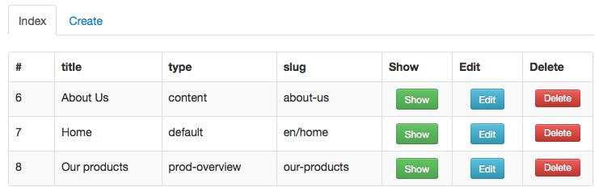

## Bamboo - scaffolding for Laravel 4
Bamboo is a package for Laravel version 4 that enables scaffolding for Eloquent models.



### Installation
* Add `"RobGordijn/Bamboo": "dev-master"` to the require section in `composer.json`.

* Run `php composer.php update` on the CLI.

* Add `'RobGordijn\Bamboo\BambooServiceProvider'` to the providers array in `app/config/app.php`.
* In the `controllers` directory, create a new controller that extends the BambooController and provides an Eloquent model in the constructor.

```php
<?php
use RobGordijn\Bamboo\BambooController;

class BlogController extends BambooController
{
	public function __construct(Blog $Model)
	{
		parent::__construct($Model);
	}
}
```

* Create a route to that controller.

```php
<?php
// a single route
Route::resource('blogs', 'BlogController');
	
// or within in a group with a prefix
Route::group(array('prefix' => 'admin'), function()
{
	Route::resource('blogs', 'BlogController');
});
```

* The last step is to provide information about the structure of your model. This is done via a public method `getStructure` in the Eloquent model.

```php
<?php
class Blog extends Eloquent
{
	public function getStructure()
	{
		$title = array(
			 'type' => 'string'
			,'onIndex' => true
		);
		$content = array(
			 'type' => 'text'
		);
		return compact('title',  'content');
	}
}
```

* done; point your browser to `/blogs` to work with Bamboo.

### Pitfalls
##### mass-assignment
Please keep in mind that the Laravel Eloquent model attributes are well protected for unwanted mass-assignment. Check the [documentation](http://laravel.com/docs/eloquent#mass-assignment) on how to set the fillable attributes. 

Hint: `protected $fillable = array('column1', 'column2');` or inversed like `protected $guarded = array();`

### Structure options
The `getStructure` method in the Eloquent model must return an array of structures. The keys are the names of your table columns. The structure has the following options:

<table>
<tr>
	<th>key</th>
	<th>value</th>
	<th>description</th>
</tr>
<tr>
	<td>type</td>
	<td>(string) text, email, password, hidden</td>
	<td>single line text input</td>
</tr>
<tr>
	<td></td>
	<td>(string) textarea</td>
	<td>textarea input</td>
</tr>
<tr>
	<td></td>
	<td>(string) radios</td>
	<td>list of radio buttons, requires 'values'</td>
</tr>
<tr>
	<td></td>
	<td>(string) select</td>
	<td>dropdown menu, requires 'values'</td>
</tr>
<tr>
	<td>label</td>
	<td>(string)</td>
	<td>String used for the label</td>
</tr>
<tr>
	<td>rules</td>
	<td>(array)</td>
	<td>Array with model rules, **not implemented yet**, use static Model::$rules meanwhile</td>
</tr>
<tr>
	<td>onIndex</td>
	<td>(bool)</td>
	<td>Display column on the index view</td>
</tr>
<tr>
	<td>attributes</td>
	<td>(array)</td>
	<td>Array with attributes used in the formbuilder</td>
</tr>
<tr>
	<td>values</td>
	<td>(array)</td>
	<td>Array with possible values for type 'radios' and 'select'</td>
</tr>
</table>

### Controller options
**Records per page (index view)**

Default: 10, specify the protected `recordsPerPage` property in the resource controller to overwrite.

**Ordering records on the index view**
Default: 'Model->getKeyName() asc', specify the protected `orderByColumn` and `orderByDirection` in the resource controller to overwrite.

**Blade layout** 

Every view uses a Blade layout to render. A default layout is shipped with Bamboo and uses  Bootstrap classes to look nice. Specify the protected `bladeLayout` property in the resource controller to overwrite.

### Translations

Bamboo ships in English, feel free to contribute.


### F.A.Q.
**What about validation?**

Specify the rules for the columns in the static property `rules`, Bamboo will pick them up when storing or updating records.

**Do I need to worry about the url of the resource controller?**

Nope, as long as you register the route to the controller with `Route::resource()`, Bamboo will figure out the rest.


**Does Bamboo generate controllers and views like [Jeffrey Way's Laravel 4 Generators](https://github.com/JeffreyWay/Laravel-4-Generators)?**

Nope, Bamboo does not generate the controllers and views for each model but reuses one controller and some views.


### Changelog
* 2013-09-26<br>
removed type 'string' and swichted it with 'text' so the only way to render a textarea is the type 'textarea'.
* 2013-09-25<br>
added active class for the nav-tabs on the index view<br>
added overwrites for orderByColumn (default: table key) and orderByDirection (default: asc)
* 2013-09-23<br>initial version commit